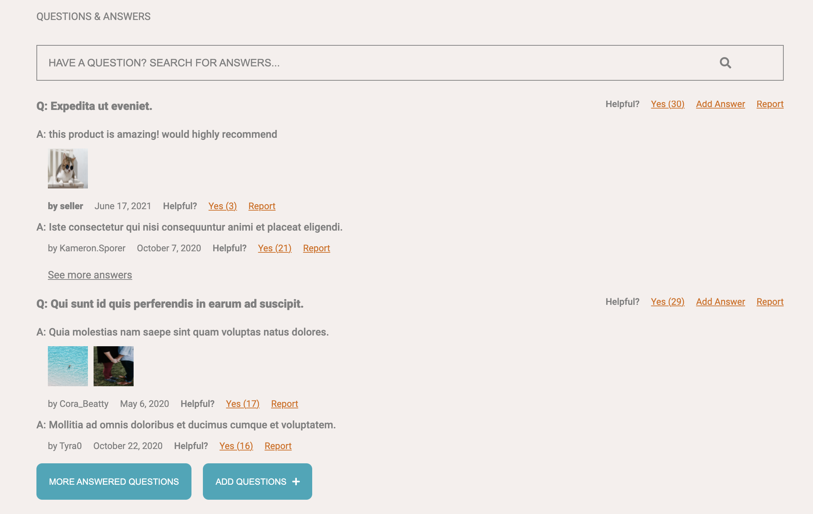

# E-Commerce Questions and Answers Service
For this project, my team was tasked with replacing the API for an e-commerce clothing retailer in order to handle increased web traffic. Each teammate focused on a different microservice. I worked on the Q&amp;A service.

## Achievements and Optimizations

* Seeded a PostgreSQL database with over 10 million records
* Optimized raw SQL query execution times to average < 1ms per query using hash indexes, joins and PostgreSQL JSON functions
* Improved throughput from around 200 requests per second to 2000 requests per second with low latency and < 1% error rate by horizontally scaling with multiple AWS servers and a load balancer

## Technologies Used

* Node
* Express
* PostreSQL
* AWS
* Loader.io
* K6
* New Relic
* Nginx

## Database Queries

Sample queries and API response objects can be found in this GitHub Gist: [Database Queries](https://gist.github.com/tskela/0f082423acd4a02ca12a1dc6328f84a1).

## Screenshot of Frontend

The API endpoints I implemented serve the frontend widget below. 



## Usage

```
npm install
npm start
```

You will need to install PostgreSQL, change the connection string in the database file to refer to your Postgres database and run the ETL code to seed your database.
